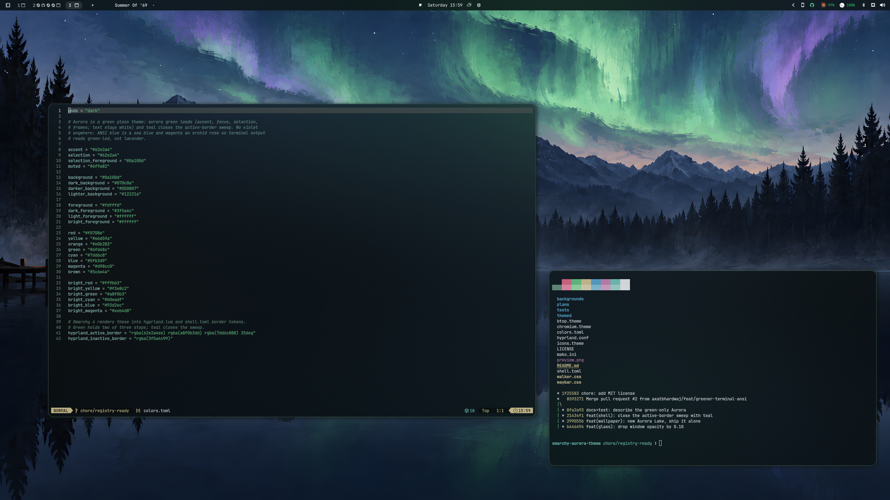

# Omarchy Aurora Theme

A green glass theme: aurora green leads (accent, focus, selection, borders; text stays white) and teal closes the active-border sweep, on a green-black base. ANSI blue is a sea blue and magenta an orchid rose, so terminal output stays green-led rather than lavender. The shell reads as dark glass catching aurora light.

Palette lives in `colors.toml`; every other file derives from it. Lead `#62e2a4`, text `#fdfffd`, support `#7dd6c8`, base `#0a100d`. The active border is a 35° sweep `green → pale green → teal`; the inactive border is dim green at 60%.



Wallpaper: "Aurora Lake" is an AI-generated illustration commissioned for this theme, upscaled 4x with Real-ESRGAN and fitted to 3840×2160.

## Installation

Install this theme by running:

```bash
omarchy-theme-install https://github.com/axatbhardwaj/omarchy-aurora-theme
```

## Shell surfaces

`shell.toml` styles Omarchy 4's bar, launcher, menus, notifications, polkit, and lock screen: dark glass at 0.80–0.96 alpha, gradient borders at ~0.75 alpha, green for selection, countdowns and text, dim green for placeholders and quiet control chrome. Windows are rounded at 14 with 11/22 gaps, a soft shadow, and buoyant, non-elastic animations.

On a Lua-configured Hyprland (Omarchy 4 default) the theme's `hyprland.conf` is never sourced and git-installed themes cannot ship Lua, so rounding, gaps, shadow, animations and the Balanced Glass policy reach the compositor through `themed/hyprland.lua.tpl`, which you copy to `~/.config/omarchy/themed/` once (Omarchy renders it for whichever theme is active); `hyprland.conf` records the same values for `.conf`-based setups.

## Balanced Glass

Balanced Glass uses xray to frost the wallpaper beneath windows. Blur is size 24 with 4 passes — Dual Kawase needs the extra radius, not extra passes; 8 passes flatten the wallpaper into a solid color. Normal windows and Nautilus sit at 0.70; browsers sit at 0.80 so pages stay readable. Dimming is off entirely, with no active/inactive opacity gap; the green-led gradient border is the focus cue.

The fully opaque protected surfaces are:

- Steam; Zoom; VLC; mpv; Kdenlive; OBS Studio; Pinta; imv; and Nautilus Previewer.
- RetroArch and qemu.
- GeForce NOW and Moonlight, pinned explicitly by this theme because their upstream app rules do not remove `default-opacity`.
- YouTube and Zoom web apps, picture-in-picture, and the webcam overlay.
- Credential windows: 1Password, Bitwarden desktop and browser extension, KeePassXC, and Proton Pass.

Alacritty and kitty are pinned opaque at the compositor so terminal glyphs stay crisp. Omarchy 4 generates their palettes, along with Neovim's Aether palette, from `colors.toml`. Git-installed themes cannot ship terminal configuration or Lua, so background-only terminal transparency belongs in a user-owned template under `~/.config/omarchy/themed/`; this repository intentionally does not bypass that boundary. Copy `themed/hyprland.lua.tpl` there so Omarchy 4 actually loads Balanced Glass — cloned themes drop `hyprland.lua` and ignore `hyprland.conf`. Zed is compositor-pinned opaque so that user-owned background transparency composes cleanly rather than stacking with compositor opacity. Ghostty and Foot are compositor-pinned and intentionally remain opaque.

The shipped CSS/INI/CSS keeps Waybar, Mako, and Walker translucent: Waybar and Mako use 0.55 alpha; Walker’s main panel composes to about 0.55, while its search row and keybind strip use raw `@base` and composite nearer 0.81. `chromium.theme` uses the base `10,16,13` (`#0a100d`), which is already lifted enough for tab-strip legibility.

## Theme Locations

After installation, certain theme files need to be manually moved to their respective locations:

### Vencord Theme
Move the Vencord theme file to:
```
~/.config/Vencord/themes/
```

Or if using Vesktop:
```
~/.config/vesktop/themes/
```

### GTK Theme
Move the GTK theme file to:
```
~/.config/gtk-4.0/gtk.css
```

For GTK 3:
```
~/.config/gtk-3.0/gtk.css
```

### Who
Made by [Bjarne Oeverli](https://x.com/iamdothash) using [Aether](https://github.com/bjarneo/Aether).
